# Git学习笔记~[2022.1.18]~

## Git目录

## 1、Git介绍
Git（读音为/gɪt/）是一个开源的分布式版本控制系统，可以有效、高速地处理从很小到非常大的项目版本管理。

Git也是Linus Torvalds为了帮助管理Linux内核开发而开发的一个开放源码的版本控制软件。

## 2、Git工具说明
Git GUI:    Git提供的图形界面工具

Git Bash:   Git提供的命令行工具

## 3、Git安装

### 3.1、Git安装过程
Git安装相对来说是比较简单的，除了安装路径之外全部默认即可。

> 如果需要修改某些选项可以[百度](www.baidu.com)查看各个选择的解释
***
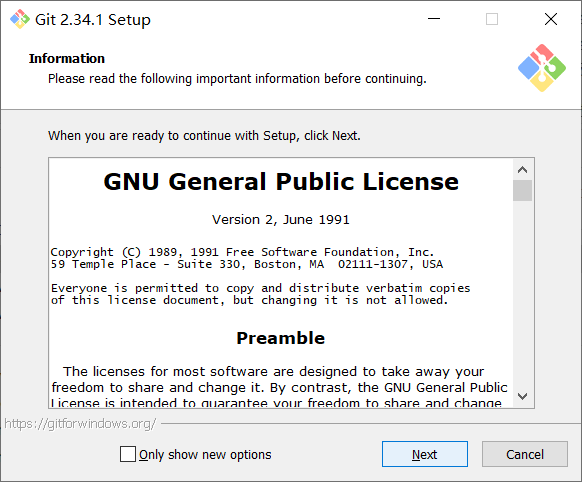
***
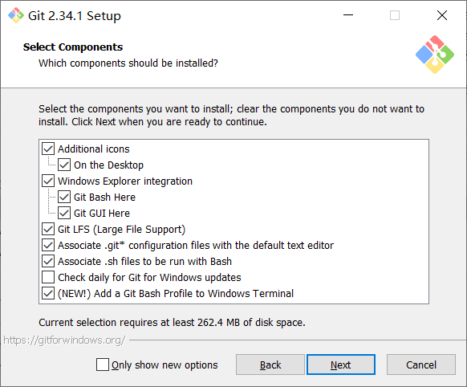
***
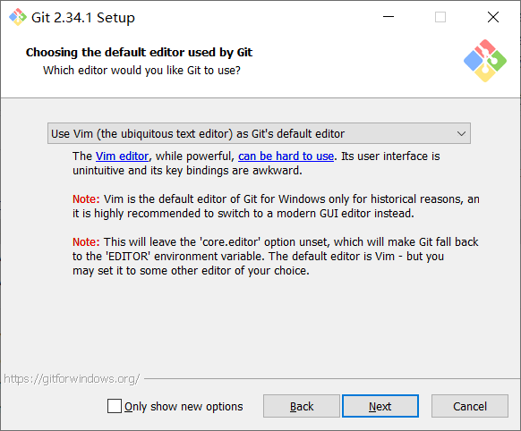
***
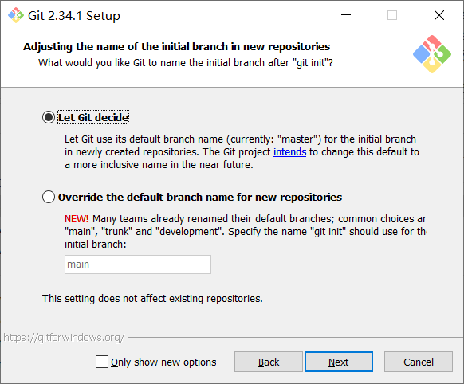
***
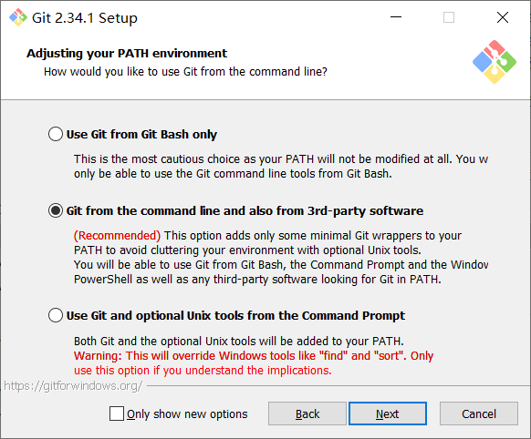
***
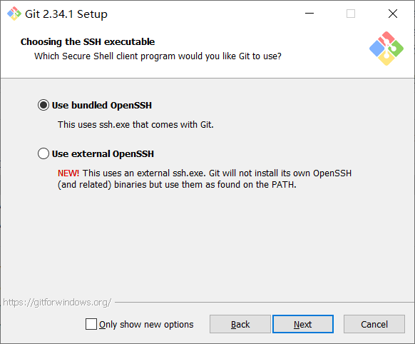
***
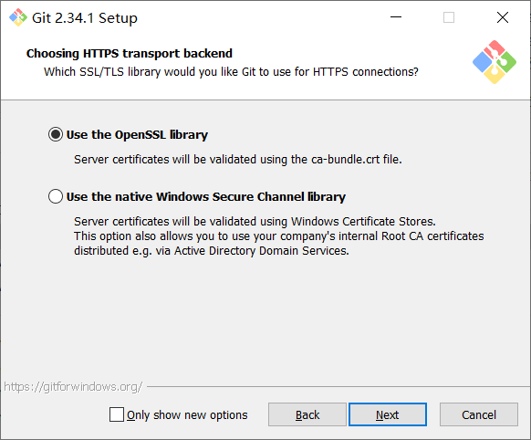
***
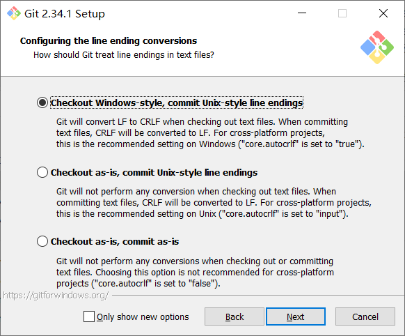
***
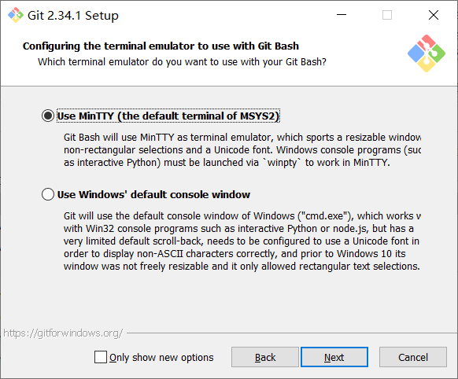
***
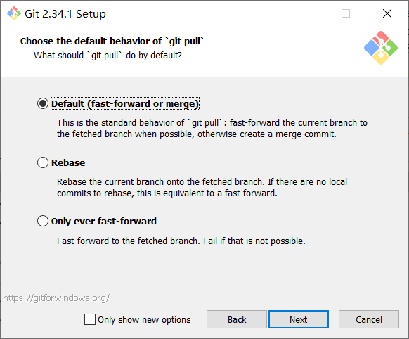
***
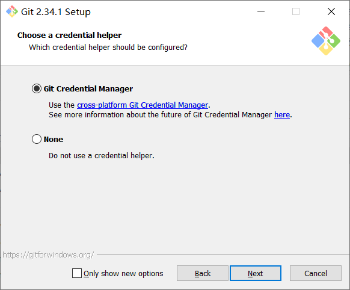
***
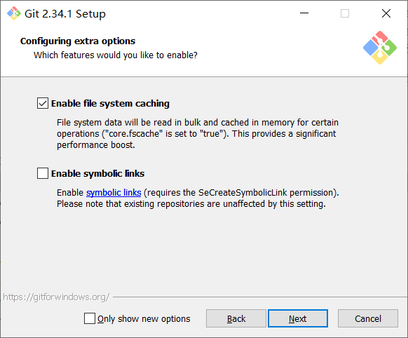
***
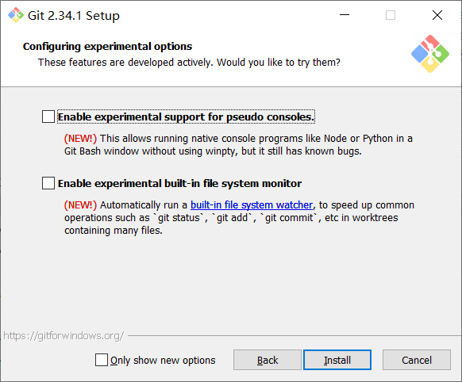
***

### 3.2、Git设置中文UI
安装完软件之后建议设置成中文方便理解，操作如下

- 打开Git Bash<br>
    
- 界面中鼠标右击选择**Options**<br>
    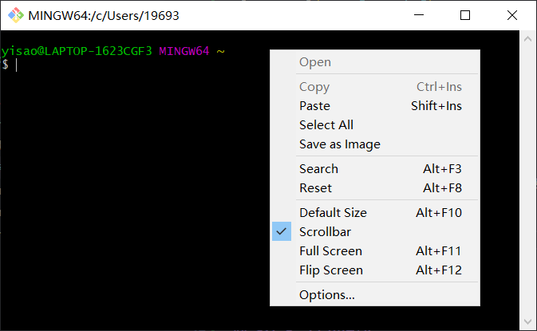
- 在设置界面选择**Window**<br>
    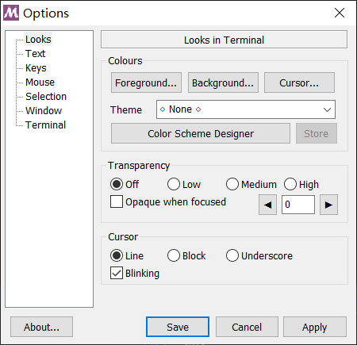
- 找到**UI language**，选择**zh_CN**<br>
    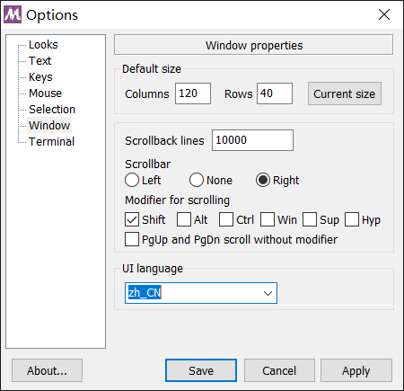
- 点击**Save**，成功后界面如下<br>
    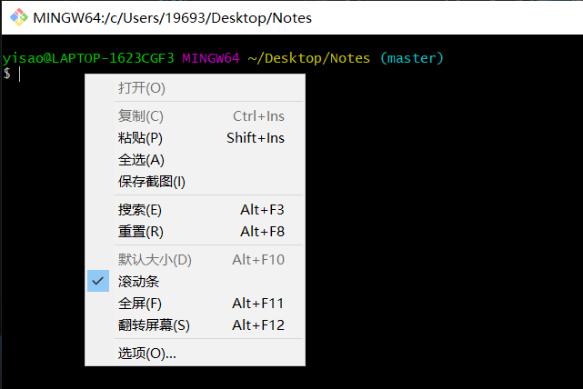
***

## 4、Git工作流程
- Git工作流程图<br>
    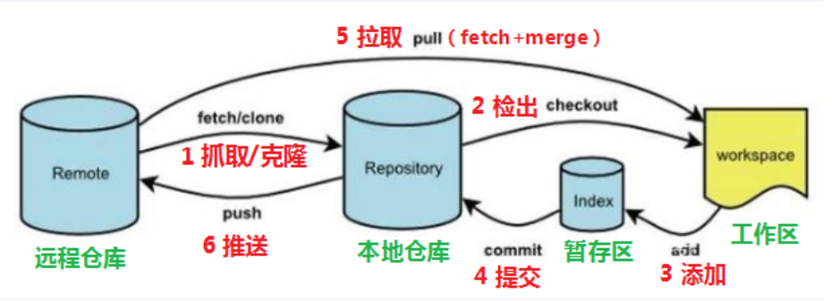

## 5、Git Bash常用指令
Git Bash可直接使用Linux系统指令，常用指令如下
```shell
cd:
    切换当前路径
ls:
    显示指定路径下的文件，默认为当前路径
    -l: 显示文件详细信息
    -a: 显示隐藏文件
    -h: 以更容易理解的方式显示
cat:
    显示文件内容
touch:
    创建文件
mkdir:
    创建文件夹
    -p: 确保目录名称存在，不存在的就建一个
vi/vim:
    Unix系统自带的编辑器，公认的最强大的命令行编辑器
```

## 6、基本配置
1. 设置用户信息
```shell
# 设置用户名
    git config --global user.name "用户名"
# 设置用户邮箱
    git config --global user.email "邮箱地址"
```
> 用户名和用户邮箱都只是为了标识提交版本的用户，如果不想提交真实性息，也可以随意填写，但要符合格式
2. 查看用户信息
```shell
# 查看用户名
    git config --global user.name
# 查看用户邮箱
    git config --global user.email
```
3. 指令别名
> 有些常用的指令参数非常多，每次都要输入好多参数，所以我们可以使用别名。
```shell
# 用于输出git提交日志
alias git-log='git log --pretty=oneline --all --graph --abbrev-commit'
# 用于输出当前目录所有文件及基本信息
alias ll='ls -al'
```
> 为了方便使用别名，不用每次打开Git Bash都设置一遍别名，可以在家目录"~/"下创建一个".bashrc"的文件保存别名指令
```shell
# 在家目录创建下创建".bashrc"文件
touch ~/.bashrc
# 打开".bashrc"文件
vi ~/.bashrc
# 最后将下面指令粘贴到打开的".bashrc"文件里
alias git-log='git log --pretty=oneline --all --graph --abbrev-commit'
alias ll='ls -al'
```
> 注:家目录下的".bashrc"文件会在开机的时候自动执行文件里的内容

## 7、本地仓库管理

### 7.1、Git工作过程
Git工作目录下对于文件的修改（增加、删除、更新）会存在几个状态，这些修改的状态会随着我们执行Git的命令而发生变化。

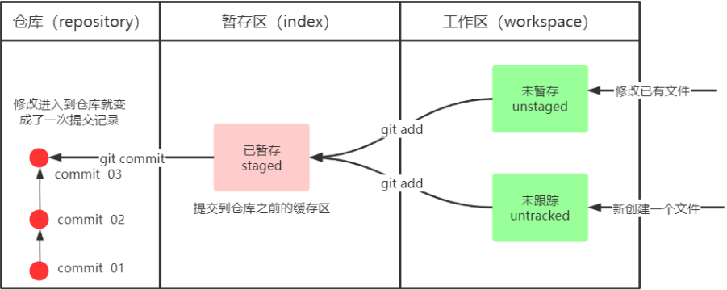

### 7.2、初始化一个工作区（创建一个新的本地仓库）
要使用Git对我们的代码进行版本控制，首先需要获得本地仓库

1. 在电脑的任意位置创建一个空目录（例如test）或者直接使用写好的项目目录作为我们的本地Git仓库
2. 进入这个目录中，点击右键打开**Git Bash**窗口
3. 执行命令`"git init"`
    > `git init`：初始化一个新的本地仓库
4. 如果创建成功后可在文件夹下看到隐藏的.git目录。<br>
    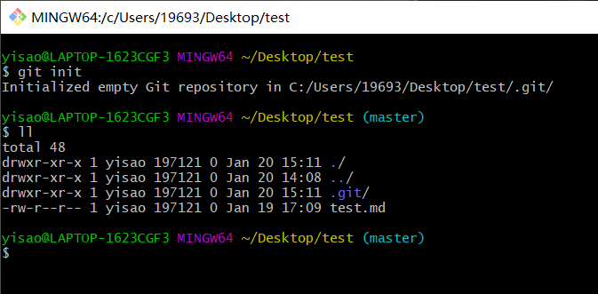


### 7.3、本地仓库基础指令
1. `status`
    - 作用：查看的修改的状态（暂存区、工作区）
    - 命令形式：`git status`
2. `add`
    - 作用：添加工作区一个或多个文件的修改到暂存区
    - 命令形式：`git add 文件名或通配符`
      - 将所有修改加入暂存区：**git add .**
3. `commit`
    - 作用：提交暂存区内容到本地仓库的当前分支
    - 命令形式：`git commit -m '注释'`
4. `log`
    - 作用：查看提交记录（记录）
    - 命令形式：`git log [option]`
      - options
        - --all 显示所有分支
        - --pretty=oneline 将提交信息显示为一行
        - --abbrev-commit 使得输出的commitID更简短
        - --graph 以图的形式显示
    > 在**6、基本配置**中配置的别名`"git-log"`就包含了**options**的参数，所以后续可以直接使用指令`"git-log"`
5. `reset`
    - 作用：版本切换
    - 命令形式：`git reset --hard commitID`
      - commitID 可以使用`git-log`或`git log`指令查看
6. `reflog`
    - 作用：查看已经删除的记录，可以看到已经删除的提交记录
    - 命令形式：`git reflog`

## 8、分支管理
几乎所有的版本控制系统都以某种形式支持分支。

使用分支意味着你可以把你的工作从开发主线上分离开来进行重大的Bug修改、开发新的功能，以免影响开发主线。

### 8.1、分支基础指令
1. `git branch`
    - 作用：查看本地分支
2. `git branch 分支名`
    - 作用：创建本地分支
3. `git checkout 分支名`
    - 作用：切换分支
4. `git checkout -b 分支名`
    - 作用：直接切换到一个不存在的分支（创建并切换）
5. `git merge 分支名`
    - 作用：合并指定分支到当前分支
6. `git branch -d 分支`
    - 作用：删除分支，并在删除时做各种检查
7. `git branch -D 分支名`
    - 作用：强制删除分支，不做如何检查
> 不能删除当前分支，只能删除其他分支

### 8.2、本地分支冲突
两个分支上对文件的修改可能会存在冲突，例如同时修改了同一个文件的同一行，这时就需要手动解决冲突

> 存在冲突时，直接`"git merge"`进行合并，会提示存在冲突的文件，并将存在冲突的语句都写到文件里，
> 
> 所以需要手动解决冲突，即可以将存在冲突的语句修改为自己想要的语句

解决冲突步骤：
1. 处理文件中冲突的地方，即修改冲突的语句为自己想要的语句
2. 将解决完冲突的文件加入暂存区(`git ad .`)
3. 提交到仓库(`git commit`)
> 这里可以直接`"git commit"`不加注释内容

### 8.3、开发中分支使用原则与流程 
在开发中，一般有如下分支使用原则与流程：

- **master**（生产）分支
  - 线上分支，主分支，中小规模项目作为线上运行的应用对应的分支；
- **develop**（开发）分支
  - 是从master创建的分支，一般作为开发部门的主要开发分支，如果没有其他并行开发不同期上线要求，都可以在此版本进行开发，阶段开发完成后，需要是合并到master分支,准备上线。
- **feature**/xxxx分支
  - 从develop创建的分支，一般是同期并行开发，但不同期上线时创建的分支，分支上的研发任务完成后合并到develop分支。
- **hotfix**/xxxx分支
  - 从master派生的分支，一般作为线上bug修复使用，修复完成后需要合并到master、test、develop分支。
- 还有一些其他分支，在此不再详述，例如test分支（用于代码测试）、pre分支（预上线分支）等等。

## 9、远程仓库管理
### 9.1、远程仓库托管
前面我们已经知道了Git中存在两种类型的仓库，即本地仓库和远程仓库。

那么我们如何搭建Git远程仓库呢？

我们可以借助互联网上提供的一些代码托管服务平台来实现，其中比较常用的有GitHub、码云、GitLab等。

[GitHub](https://github.com/)是一个面向开源及私有软件项目的托管平台，因为只支持Git作为唯一的版本库格式进行托管，故名GitHub

[Gitee(码云)](https://gitee.com/)是国内的一个代码托管平台，由于服务器在国内，所以相比于GitHub，码云速度会更快

[GitLab](https://about.gitlab.com/)是一个用于仓库管理系统的开源项目，使用Git作为代码管理工具，并在此基础上搭建起来的web服务,一般用于在企业、学校等内部网络搭建git私服。

### 9.2、远程仓库基础指令
1. 添加远程仓库
    - 命令：`git remote add <远端名称> <仓库路径>`
      - 远端名称：默认是**origin**，取决于远端服务器设置，可自定义
      - 仓库路径：从远端服务器获取此URL
        - SSH：需要配置SSH公钥，可不用输入账号密码即可管理仓库，建议在本人经常使用的电脑使用
        - HTTPS：每次都需要输入账号密码进行登录才可操作仓库，不建议在经常使用的电脑使用，避免麻烦
      - 例：`git remote add origin_gitee git@gitee.com:yi-sao/note.git`
2. 查看远程仓库
    - 命令：`git remote`
3. 推送到远程仓库
    - 命令：`git push [-f] [--set-upstream] [远端名称] [本地分支名]:[远端分支名]`
      - 如果远程分支名和本地分支名称相同，则可以只写本地分支
        - 例：`git push origin_gitee master`
      - -f：强制覆盖，不建议使用，
      - `--set-upstream`  推送到远端的同时并且建立起和远端分支的关联关系。
        - 例：`git push --set-upstream origin_gitee master`
      - 如果当前分支已经和远端分支关联，则可以省略分支名和远端名。
        - 即：`git push`可以直接将已关联的本地分支推送到已关联的远端分支。
4. 查询关联关系
    - 命令：`git branch -vv`
5. 从远程仓库克隆
    - 命令：`git clone <远程仓库路径> [本地路径]`
    - 本地路径可以省略，系统会自动在当前路径创建一个本地仓库
6. 从远程仓库抓取和拉取
    > 远程分支和本地的分支一样，我们可以进行`merge`操作，只是需要先把远端仓库里的更新都下载到本地，再进行操作。
    - 抓取
      - 命令：`git fetch [remote name] [branch name]`
      - 作用：抓取指令就是将远程仓库里的更新都抓取到本地，但是不会进行合并，而是创建一个新的分支，如果需要合并，可以使用`git merge`
      - 
      - 注意：如果不指定远端名称和分支名，则抓取所有分支。
    - 拉取
      - 命令：`git pull [remote name] [branch name]`
      - 作用：拉取指令就是将远程仓库的修改拉到本地并自动进行合并，等同于`git fetch + git merge`
      - 注意：如果不指定远端名称和分支名，则抓取所有分支并更新到当前分支。

### 9.3、远端分支冲突
当本地分支和远端分支存在冲突时，我们不能直接将本地分支推送到远端进行合并（除非`-f`），

所以我们需要先抓取/拉取远程仓库的提交到本地，经过合并后才能重新推送到远端分支，

因为远程分支也是分支，所以合并解决冲突时的解决方式也和解决本地分支冲突相同，也就不在赘述了。

## 10、学海无涯

### 10.1、指令
1. `git commit --amend`
    - 查看提交文件，里面包含注释和变更内容
2. `git remote set-url <远端仓库名称> [仓库路径]`
    - 修改远端仓库的路径**url**
3. `git remote -v`
    - 查询仓库路径
4. `git remote rm <远端仓库名称>`
    - 删除指定的远端仓库